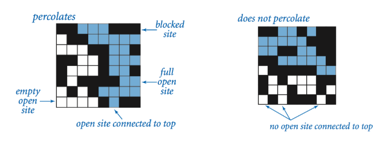
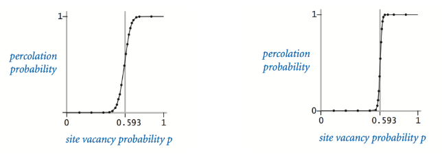
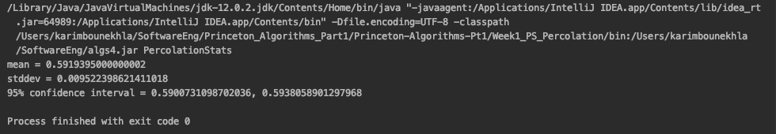
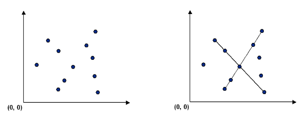
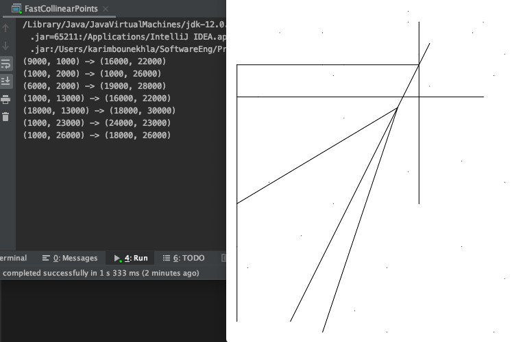
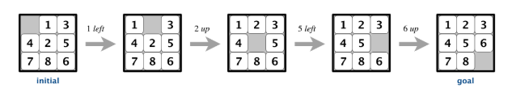
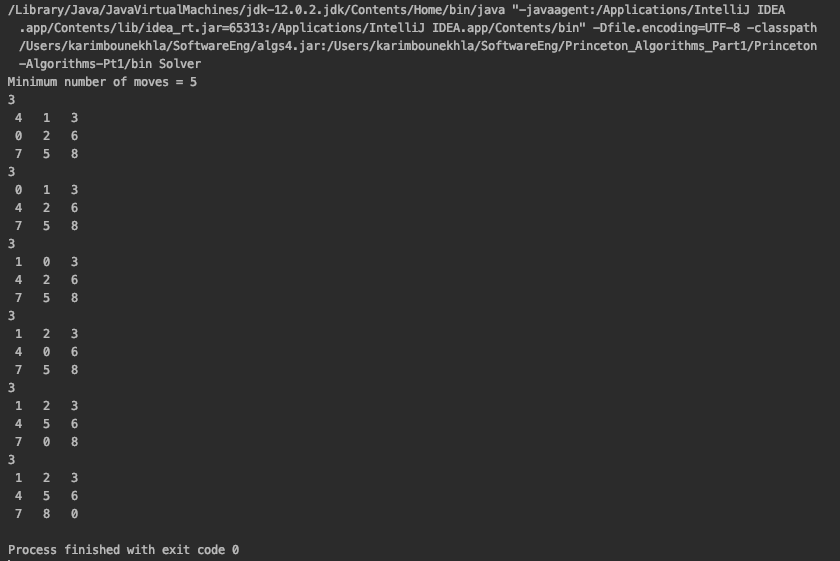
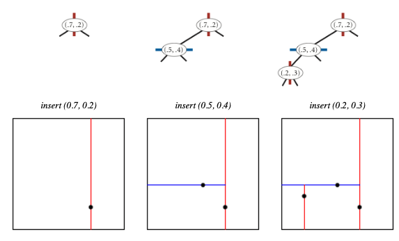

# Algorithms (Princeton University)

[Introduction to Algorithms](https://coursera.org/learn/algorithms-part1), created by Princeton University.

This course covers algorithms and data structures, with emphasis on applications and performance analysis of Java implementations. 

Part I covers elementary data structures, sorting, and searching algorithms. Part II focuses on graph- and string-processing algorithms.

This repo contains my work in progress for Part 1 of the course - Part 2 coming soon.

## Week 1 - Percolation

This assignment explores the concept of percolation using a model composed of an n-by-n grid of sites. Each site being either `open` or `blocked`. A `full` site is an open site that can be connected to an open site in the top row. A system is said to **percolate** if there is a full site in the bottom row - i.e. it is connected to the top row.



(From the problem statement)

*Given a composite systems comprised of randomly distributed insulating and metallic materials:  what fraction of the materials need to be metallic so that the composite system is an electrical conductor? Given a porous landscape with water on the surface (or oil below), under what conditions will the water be able to drain through to the bottom (or the oil to gush through to the surface)? Scientists have defined an abstract process known as percolation to model such situations.*


The objective of this problem set was to determine the probability that a system will percolate if sites are independent and set to open with probability `p`. When `p` equals 0, the system does not percolate, and when `p` equals 1, the system percolates (all sites are open). When `n` is sufficiently large, there is a threshold probability `p*` at which the system will tend to percolate (around 0.593).  



In this program, I modelled the [Percolation system](Week1_PS_Percolation/src/Percolation.java) (n-by-n grid) and ran a [Monte Carlo simulation](Week1_PS_Percolation/src/PercolationStats.java) to estimate the percolation threshold using the Union-find algorithm. 

Results were consistent with the experimentally observed percolation threshold.



## Week 2 - Queues

The goal of this assignment was to program a deque (double-ended queue) and a randomized queue implementing the following API's (respectively):

```
public class Deque<Item> implements Iterable<Item> {

    // construct an empty deque
    public Deque()

    // is the deque empty?
    public boolean isEmpty()

    // return the number of items on the deque
    public int size()

    // add the item to the front
    public void addFirst(Item item)

    // add the item to the back
    public void addLast(Item item)

    // remove and return the item from the front
    public Item removeFirst()

    // remove and return the item from the back
    public Item removeLast()

    // return an iterator over items in order from front to back
    public Iterator<Item> iterator()

    // unit testing (required)
    public static void main(String[] args)
}
```

```
public class RandomizedQueue<Item> implements Iterable<Item> {

    // construct an empty randomized queue
    public RandomizedQueue()

    // is the randomized queue empty?
    public boolean isEmpty()

    // return the number of items on the randomized queue
    public int size()

    // add the item
    public void enqueue(Item item)

    // remove and return a random item
    public Item dequeue()

    // return a random item (but do not remove it)
    public Item sample()

    // return an independent iterator over items in random order
    public Iterator<Item> iterator()

    // unit testing (required)
    public static void main(String[] args)

}
```

## Week 3 - Collinear Points

 Given a set of `n` distict points, the goal of this assignment is to find every (maximal) line segments that connects a subset of 4 or more of the points

 

 Two methods were implemented, first a Brute-force method that examines 4 points at a time and check whether they all lie on the same line segment (if the slopes between the points are all equal). The running time of this method is N^4 and is not practical.

 The second method implements fast sorting algorithm to find collinear points in N^2*log(N) time.
 ```
Think of p as the origin.

For each other point q, determine the slope it makes with p.

Sort the points according to the slopes they makes with p.

Check if any 3 (or more) adjacent points in the sorted order have equal slopes with respect to p. 
If so, these points, together with p, are collinear.
```

Given an input of points, such as this.
```
50
 26000  27000
 24000  23000
 18000  23000
 22000   9000
 25000  25000
  1000   2000
 12000  10000
 22000  17000
 25000   1000
 15000   1000
 19000  28000
 12000   3000
  4000  15000
  2000   7000
 18000  27000
  1000  13000
  9000  26000
 11000  26000
  6000  16000
 18000  30000
 18000  26000
 24000  30000
 10000  25000
  7000  10000
 19000  24000
  6000      0
 26000  15000
  1000  23000
 23000  29000
 15000   7000
 15000  19000
 17000  31000
  6000   2000
 17000  16000
  1000  26000
 11000  19000
 25000      0
 17000  30000
 16000  22000
 18000  13000
  3000  23000
 10000  13000
  1000   9000
 11000  21000
 29000  19000
  9000  29000
 30000   3000
  9000   1000
  5000  29000
 26000   6000
```

The result is a list of collinear point (Displayed on the right using a visualizer library provided by the course).

 


 ## Week 4 - 8Puzzle

 The goal of this assignment is to write a program that solves the 8-puzzle problem using the A* search algorithm.
 
 
(From the problem statement)

*The 8-puzzle is a sliding puzzle that is played on a 3-by-3 grid with 8 square tiles labeled 1 through 8, plus a blank
  square. The goal is to rearrange the tiles so that they are in row-major order, using as few moves as possible. 
  You are permitted to slide tiles either horizontally or vertically into the blank square. 
  The following diagram shows a sequence of moves from an initial board (left) to the goal board (right).*




This problem was solved with the A* search algorithm and the use of priority queues. The priority function used used is based on the Manhattan distance = the number of moves made so far + the manhattan distance of the board. 

After each potential move (based on the neighbors of the blank tile), the algorithm maintains a priority queue of the potential states of the board following that move - and processes the state with the lowest priority (i.e. closer to the optimal solution).

Given the following board (where 0 represents blank space)

```
 4   1   3   
 0   2   6   
 7   5   8   
 ```

The program outputs the result and moves leading to the solution

  

## Week 5 - KdTree

Write a data type to represent a set of points in the unit square (all points have x- and y-coordinates between 0 and 1) using a 2d-tree to support efficient **range search** (find all of the points contained in a query rectangle) and **nearest-neighbor search** (find a closest point to a query point).


This was solved using a 2d-tree implementation; a generalization of a BST to two-dimensional keys, i.e. with points in the nodes, using the x- and y-coordinates of the points as keys in strictly alternating sequence.



The prime advantage of a 2d-tree over a BST is that it supports efficient implementation of range search and nearest-neighbor search. Each node corresponds to an axis-aligned rectangle in the unit square, which encloses all of the points in its subtree. The root corresponds to the unit square; the left and right children of the root corresponds to the two rectangles split by the x-coordinate of the point at the root; and so forth.
